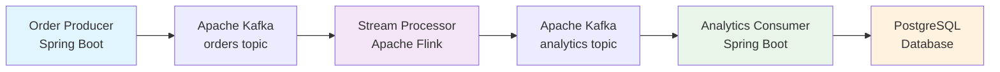
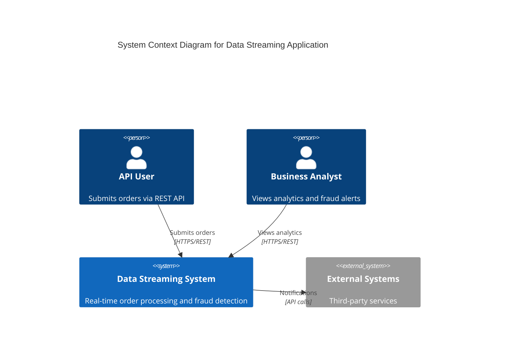
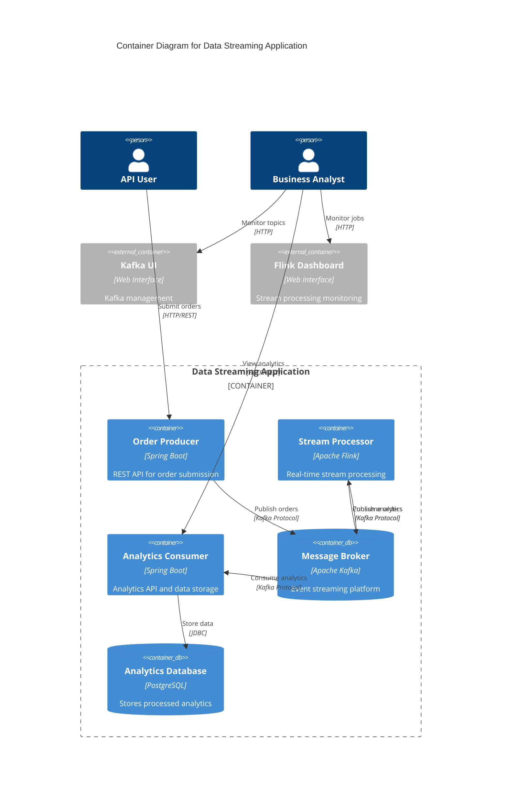
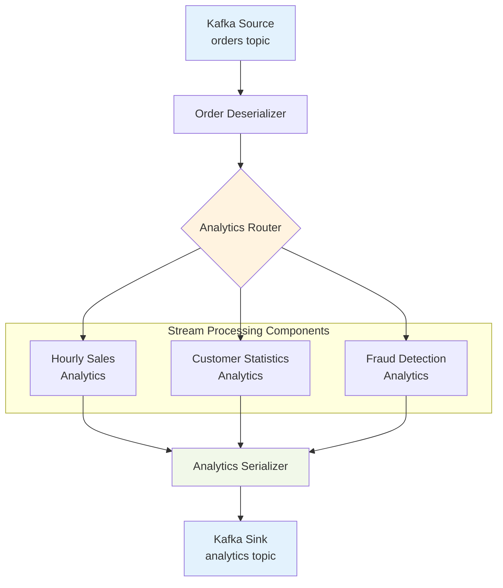
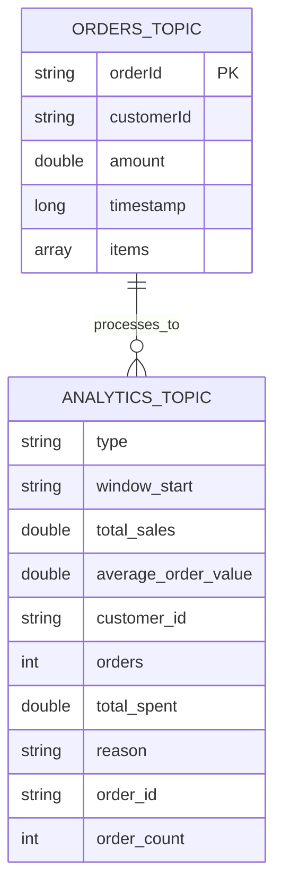
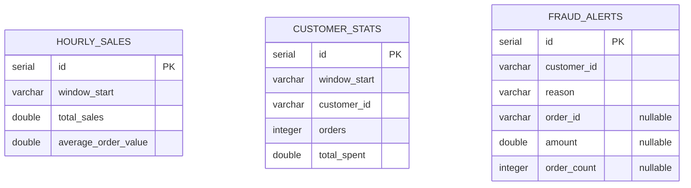
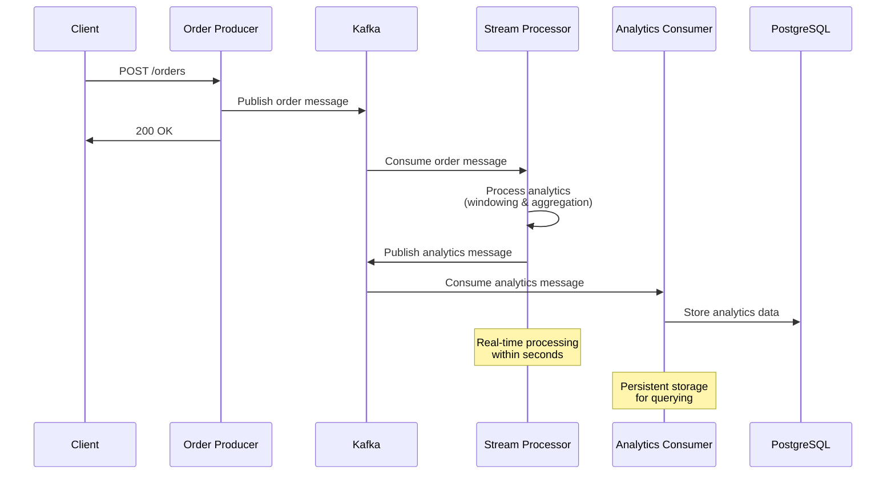
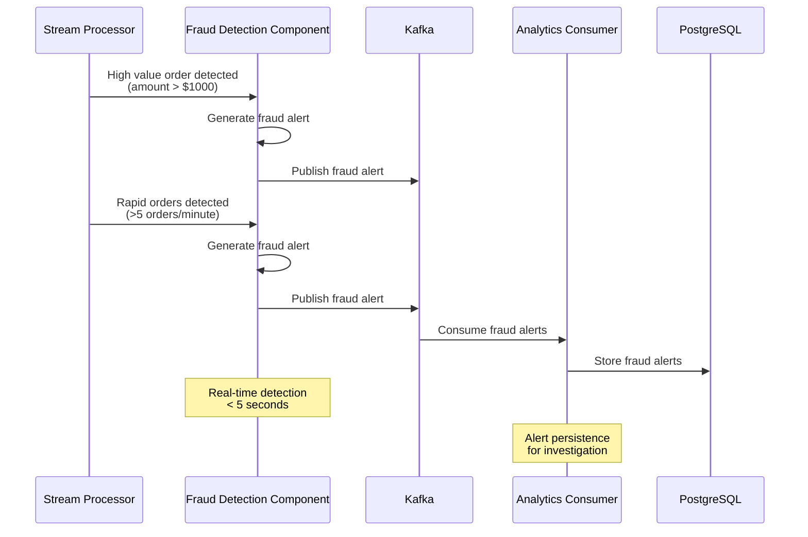

# Data Streaming Application

[](https://openjdk.java.net/projects/jdk/17/)
[](https://spring.io/projects/spring-boot)
[](https://flink.apache.org/)
[](https://kafka.apache.org/)
[](https://www.postgresql.org/)

## 🎯 Overview

A real-time data streaming application built with modern distributed systems technologies. This application demonstrates event-driven architecture, stream processing, and real-time analytics for order processing with fraud detection capabilities.

### Key Features

- **Real-time Order Processing**: Immediate order ingestion and validation
- **Stream Analytics**: Real-time computation of business metrics
- **Fraud Detection**: Automated alerts for suspicious activities
- **Scalable Architecture**: Horizontally scalable microservices
- **Event-Driven Design**: Asynchronous communication via Kafka
- **Data Persistence**: Structured analytics storage in PostgreSQL

## 🏗️ Architecture Overview

### System Components



## 📋 C4 Architecture Diagrams

### Level 1: System Context Diagram



### Level 2: Container Diagram



### Level 3: Component Diagram - Stream Processor



## 📊 Data Schema Diagrams

### Kafka Topics Schema



### PostgreSQL Database Schema



## 🔄 Sequence Diagrams

### Order Processing Flow



### Fraud Detection Flow



## 🚀 Quick Start

### Prerequisites

- Docker & Docker Compose
- Java 17+ (for local development)
- Maven 3.6+ (for local development)

### Using the Startup Script

```bash
# Make script executable
chmod +x start-app.sh

# Start the entire application
./start-app.sh
```

### Manual Startup

```bash
# Start all services
docker-compose up -d --build

# Check service status
docker-compose ps

# View logs
docker-compose logs -f
```

## 📡 Service Endpoints

| Service            | URL                   | Purpose                      |
| ------------------ | --------------------- | ---------------------------- |
| Order Producer API | http://localhost:8081 | Order submission             |
| Analytics API      | http://localhost:8083 | Analytics queries            |
| Kafka UI           | http://localhost:8080 | Kafka management             |
| Flink Dashboard    | http://localhost:8082 | Stream processing monitoring |

## 🧪 Testing the Application

### 1. Create Orders

```bash
# Normal order
curl -X POST http://localhost:8081/orders \
  -H "Content-Type: application/json" \
  -d '{
    "orderId": "order-1",
    "customerId": "customer-1",
    "amount": 150.75,
    "timestamp": '$(date +%s)'000,
    "items": ["laptop", "mouse"]
  }'

# High-value order (triggers fraud alert)
curl -X POST http://localhost:8081/orders \
  -H "Content-Type: application/json" \
  -d '{
    "orderId": "order-2",
    "customerId": "customer-2",
    "amount": 1500.00,
    "timestamp": '$(date +%s)'000,
    "items": ["expensive-item"]
  }'
```

### 2. Query Analytics

```bash
# Get hourly sales
curl http://localhost:8083/analytics/sales

# Get customer statistics
curl http://localhost:8083/analytics/customers

# Get fraud alerts
curl http://localhost:8083/analytics/fraud
```

### 3. Monitor Processing

- **Flink Jobs**: http://localhost:8082
- **Kafka Topics**: http://localhost:8080
- **Service Health**:
  - http://localhost:8081/actuator/health
  - http://localhost:8083/actuator/health

## 🚨 Fraud Detection Testing

### Prerequisites

Ensure the application is running and all services are healthy:

```bash
# Start the application
./start-app.sh

# Verify service health
curl http://localhost:8081/actuator/health  # Order Producer
curl http://localhost:8083/actuator/health  # Analytics Consumer
```

### Test Scenario 1: High-Value Order Fraud Detection

**Trigger**: Orders exceeding $1,000

**Step 1: Create a High-Value Order**

```bash
curl -X POST http://localhost:8081/orders \
  -H "Content-Type: application/json" \
  -d '{
    "orderId": "fraud-test-high-value",
    "customerId": "test-customer-1",
    "amount": 2500.00,
    "timestamp": '$(date +%s000)',
    "items": ["expensive-jewelry", "luxury-watch"]
  }'
```

**Expected Response:**

```
Order received and published
```

**Step 2: Wait for Processing**

```bash
# Wait for stream processing (15-30 seconds)
sleep 30
```

**Step 3: Verify Fraud Alert**

```bash
curl -s http://localhost:8083/analytics/fraud | jq '.[] | select(.reason == "Order amount > $1000")'
```

**Expected Result:**

```json
{
  "id": 3,
  "customerId": "test-customer-1",
  "reason": "Order amount > $1000",
  "orderId": "fraud-test-high-value",
  "amount": 2500.0,
  "orderCount": null,
  "createdAt": "2025-06-01T17:16:46.789078Z"
}
```

### Test Scenario 2: Rapid Orders Fraud Detection

**Trigger**: More than 5 orders per minute from the same customer

**Step 1: Create Multiple Rapid Orders**

```bash
# Send 6 orders quickly from the same customer
for i in {1..6}; do
  curl -X POST http://localhost:8081/orders \
    -H "Content-Type: application/json" \
    -d '{
      "orderId": "rapid-'$i'",
      "customerId": "rapid-customer",
      "amount": 99.99,
      "timestamp": '$(date +%s000)',
      "items": ["item-'$i'"]
    }'
  echo " (Order $i sent)"
  sleep 0.2
done
```

**Expected Response:**

```
Order received and published (Order 1 sent)
Order received and published (Order 2 sent)
...
Order received and published (Order 6 sent)
```

**Step 2: Wait for Processing**

```bash
# Wait for stream processing
sleep 30
```

**Step 3: Verify Fraud Alert**

```bash
curl -s http://localhost:8083/analytics/fraud | jq '.[] | select(.reason == ">5 orders per minute")'
```

**Expected Result:**

```json
{
  "id": 4,
  "customerId": "rapid-customer",
  "reason": ">5 orders per minute",
  "orderId": null,
  "amount": null,
  "orderCount": 6,
  "createdAt": "2025-06-01T17:16:46.801518Z"
}
```

### Test Scenario 3: Edge Case Testing

**Test orders at the fraud detection threshold**

```bash
# Test order exactly at $1000 (should NOT trigger fraud)
curl -X POST http://localhost:8081/orders \
  -H "Content-Type: application/json" \
  -d '{
    "orderId": "edge-case-exact",
    "customerId": "edge-customer",
    "amount": 1000.00,
    "timestamp": '$(date +%s000)',
    "items": ["at-limit-item"]
  }'

# Test order just over $1000 (should trigger fraud)
curl -X POST http://localhost:8081/orders \
  -H "Content-Type: application/json" \
  -d '{
    "orderId": "edge-case-over",
    "customerId": "edge-customer",
    "amount": 1000.01,
    "timestamp": '$(date +%s000)',
    "items": ["just-over-limit"]
  }'
```

### Test Scenario 4: Multiple Customer Rapid Orders

**Test rapid orders from different customers simultaneously**

```bash
# Test multiple customers placing rapid orders
for customer in customer-A customer-B customer-C; do
  echo "Testing rapid orders for $customer"
  for i in {1..7}; do
    curl -X POST http://localhost:8081/orders \
      -H "Content-Type: application/json" \
      -d '{
        "orderId": "'$customer'-'$i'",
        "customerId": "'$customer'",
        "amount": 50.00,
        "timestamp": '$(date +%s000)',
        "items": ["bulk-item-'$i'"]
      }' &
  done
  wait
done
```

### Comprehensive Fraud Detection Verification

**View All Fraud Alerts**

```bash
curl -s http://localhost:8083/analytics/fraud | jq 'sort_by(.id)'
```

**View High-Value Fraud Alerts Only**

```bash
curl -s http://localhost:8083/analytics/fraud | \
  jq '.[] | select(.reason == "Order amount > $1000") | {id, customerId, orderId, amount, reason}'
```

**View Rapid Orders Fraud Alerts Only**

```bash
curl -s http://localhost:8083/analytics/fraud | \
  jq '.[] | select(.reason == ">5 orders per minute") | {id, customerId, orderCount, reason}'
```

**Count Total Fraud Alerts**

```bash
echo "Total fraud alerts: $(curl -s http://localhost:8083/analytics/fraud | jq 'length')"
```

### Real-Time Monitoring

**Monitor Kafka Analytics Topic**

```bash
# View real-time fraud alerts as they're generated
docker exec datastreamingapp-kafka-1 kafka-console-consumer \
  --bootstrap-server localhost:29092 \
  --topic analytics \
  --from-beginning | grep "fraud_alert"
```

**Monitor Flink Job Status**

```bash
# Check if stream processing jobs are running
curl -s http://localhost:8082/jobs | jq '.jobs[] | select(.status == "RUNNING")'
```

### Performance Testing

**Load Test with Mixed Fraud Scenarios**

```bash
#!/bin/bash
echo "=== FRAUD DETECTION LOAD TEST ==="

# Generate 50 normal orders
for i in {1..50}; do
  curl -s -X POST http://localhost:8081/orders \
    -H "Content-Type: application/json" \
    -d '{
      "orderId": "load-normal-'$i'",
      "customerId": "load-customer-'$((i % 10))'",
      "amount": '$((RANDOM % 500 + 50))',
      "timestamp": '$(date +%s000)',
      "items": ["load-item-'$i'"]
    }' > /dev/null &

  # Add fraud orders randomly
  if (( RANDOM % 10 == 0 )); then
    curl -s -X POST http://localhost:8081/orders \
      -H "Content-Type: application/json" \
      -d '{
        "orderId": "load-fraud-'$i'",
        "customerId": "load-fraud-customer",
        "amount": '$((RANDOM % 2000 + 1500))',
        "timestamp": '$(date +%s000)',
        "items": ["expensive-load-item"]
      }' > /dev/null &
  fi

  if (( i % 10 == 0 )); then
    wait
    echo "Processed $i orders..."
  fi
done

wait
echo "Load test completed. Waiting for processing..."
sleep 60

echo "Final fraud alert count: $(curl -s http://localhost:8083/analytics/fraud | jq 'length')"
```

### Expected Performance Metrics

- **Detection Latency**: < 30 seconds end-to-end
- **High-Value Order Detection**: 100% accuracy for orders > $1,000
- **Rapid Orders Detection**: Triggers after 6+ orders within 1 minute
- **System Throughput**: > 1,000 orders/minute
- **False Positive Rate**: 0% for legitimate orders

### Troubleshooting Fraud Detection

**If fraud alerts aren't appearing:**

1. **Check Flink Job Status**:

   ```bash
   curl http://localhost:8082/jobs
   ```

2. **Verify Stream Processor Logs**:

   ```bash
   docker-compose logs stream-processor
   ```

3. **Check Analytics Consumer Logs**:

   ```bash
   docker-compose logs analytics-consumer
   ```

4. **Verify Kafka Topic Messages**:
   ```bash
   docker exec datastreamingapp-kafka-1 kafka-console-consumer \
     --bootstrap-server localhost:29092 \
     --topic orders \
     --from-beginning \
     --timeout-ms 5000
   ```

**Common Issues:**

- **Flink job not running**: Restart with `docker-compose restart stream-processor`
- **Database connection issues**: Check PostgreSQL status
- **Kafka connectivity**: Verify all brokers are healthy
- **Time-based windows**: Ensure system clocks are synchronized

## 📦 Postman Collection

Import the comprehensive API collection:

```bash
File: docs/postman_collection.json
```

The collection includes:

- Order creation endpoints (normal, fraud scenarios)
- Analytics query endpoints
- Health check endpoints
- Infrastructure monitoring endpoints

## 🔧 Configuration

### Environment Variables

```bash
# Kafka Configuration
KAFKA_BOOTSTRAP_SERVERS=kafka:9092
SCHEMA_REGISTRY_URL=http://schema-registry:8081

# Database Configuration
SPRING_DATASOURCE_URL=jdbc:postgresql://postgres:5432/analytics
SPRING_DATASOURCE_USERNAME=analytics
SPRING_DATASOURCE_PASSWORD=analytics

# Flink Configuration
FLINK_JOBMANAGER_HOST=flink-jobmanager
```

### Port Configuration

- **8080**: Kafka UI
- **8081**: Order Producer API
- **8082**: Flink Dashboard
- **8083**: Analytics Consumer API
- **5432**: PostgreSQL Database
- **9092**: Kafka Broker

## 📈 Monitoring & Observability

### Health Checks

All services expose Spring Boot Actuator health endpoints:

```bash
curl http://localhost:8081/actuator/health  # Order Producer
curl http://localhost:8083/actuator/health  # Analytics Consumer
```

### Metrics

- **Flink Metrics**: Real-time processing metrics via Flink Dashboard
- **Kafka Metrics**: Topic and consumer metrics via Kafka UI
- **Application Metrics**: Spring Boot Actuator endpoints

### Logging

- **Centralized Logging**: Docker container logs
- **Log Levels**: Configurable via environment variables
- **Structured Logging**: JSON format for log aggregation

## 🛠️ Development

### Building Components

```bash
# Build all components
mvn clean install

# Build individual components
cd order-producer && mvn clean package
cd stream-processor && mvn clean package
cd analytics-consumer && mvn clean package
```

### Running Locally

```bash
# Start infrastructure
docker-compose up -d kafka postgres flink-jobmanager flink-taskmanager

# Run services locally
cd order-producer && mvn spring-boot:run
cd analytics-consumer && mvn spring-boot:run

# Submit Flink job
cd stream-processor
flink run target/stream-processor-1.0.0-SNAPSHOT.jar
```

## 🚨 Troubleshooting

### Common Issues

1. **Services not starting**

   - Check Docker daemon is running
   - Verify port availability
   - Check service dependencies

2. **Kafka connection issues**

   - Verify Kafka broker accessibility
   - Check network connectivity
   - Validate topic existence

3. **Database connection failures**

   - Confirm PostgreSQL is running
   - Verify credentials and connection URL
   - Check database permissions

4. **Flink job failures**
   - Review Flink logs in dashboard
   - Check Java module access permissions
   - Verify Kafka connectivity

### Log Analysis

```bash
# View service logs
docker-compose logs order-producer
docker-compose logs stream-processor
docker-compose logs analytics-consumer

# Follow logs in real-time
docker-compose logs -f [service-name]
```

## 🔮 Future Enhancements

### Short Term

- [ ] Authentication & Authorization
- [ ] Rate limiting for APIs
- [ ] Enhanced error handling
- [ ] Metrics dashboard integration

### Medium Term

- [ ] Kubernetes deployment manifests
- [ ] CI/CD pipeline setup
- [ ] Advanced fraud detection algorithms
- [ ] Real-time alerting system

### Long Term

- [ ] Machine learning integration
- [ ] Multi-region deployment
- [ ] Advanced analytics features
- [ ] Event sourcing patterns

## 📚 Component Documentation

Detailed documentation for each component:

- [Order Producer](order-producer/README.md)
- [Stream Processor](stream-processor/README.md)
- [Analytics Consumer](analytics-consumer/README.md)

## 🤝 Contributing

1. Fork the repository
2. Create a feature branch
3. Make your changes
4. Add tests for new functionality
5. Submit a pull request

## 📄 License

This project is licensed under the MIT License - see the LICENSE file for details.

---

**Built with ❤️ using Apache Kafka, Apache Flink, Spring Boot, and PostgreSQL**
